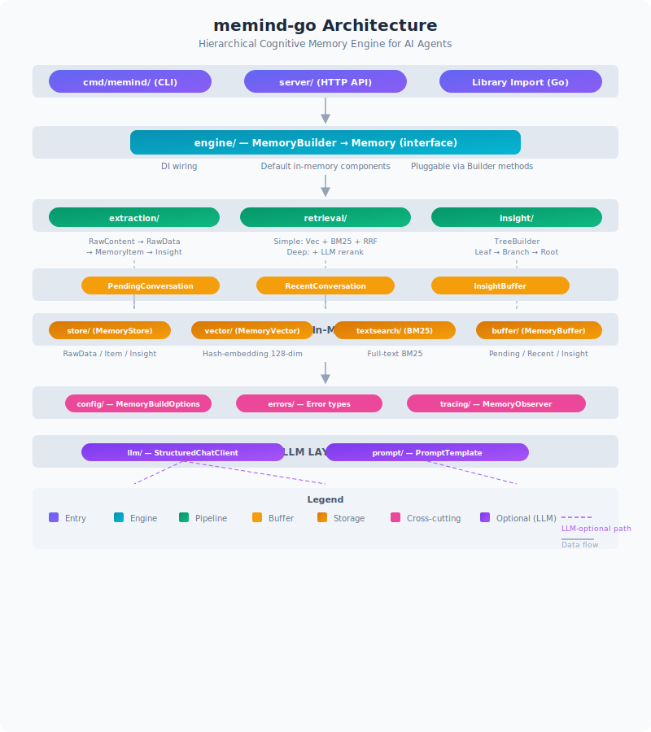

<p align="center">
  <strong>Memory that thinks. Context that evolves.</strong>
</p>

<p align="center">
  <a href="#overview">Overview</a> ·
  <a href="#quick-start">Quick Start</a> ·
  <a href="#usage">Usage</a> ·
  <a href="#architecture">Architecture</a> ·
  <a href="#api">API</a>
</p>

<p align="center">
  <a href="./LICENSE"></a>
  <a href="./README.md"></a>
  <a href="./README_zh.md"></a>
</p>

<p align="center">
  <a href="#"></a>
  <a href="#"></a>
  <a href="#"></a>
</p>

---

**memind-go** is a Go-native port of the [memind](https://github.com/openmemind/memind) hierarchical cognitive memory and context engine for AI agents. It reimplements the core engine — Insight Tree, dual retrieval strategies, extraction pipeline — in idiomatic Go with zero external dependencies.

Instead of treating memory as flat, isolated facts, memind continuously extracts, organizes, and evolves knowledge into a structured **Insight Tree** with three tiers, each revealing patterns the previous one cannot see.

---

<a id="overview"></a>

## Overview

### What is Memind?

Memind is a hierarchical cognitive memory and context engine for AI agents. It tackles two core problems of agent memory:

- **Flat, unstructured storage** — memories remain disconnected facts with no higher-level organization
- **No knowledge evolution** — memories accumulate but never consolidate into deeper understanding

### Insight Tree

| Tier | Input | What it produces |
|------|-------|-----------------|
| 🍃 **Leaf** | Grouped memory items | Insights within a single semantic group |
| 🌿 **Branch** | Multiple leaves | Cross-group patterns within one dimension |
| 🌳 **Root** | Multiple branches | Cross-dimensional insights invisible at lower levels |

### Two-Scope Memory

| Scope | Categories | Purpose |
|-------|-----------|---------|
| **USER** | Profile, Behavior, Event | User identity, preferences, relationships, experiences |
| **AGENT** | Tool, Directive, Playbook, Resolution | Tool usage experience, durable instructions, reusable workflows |

### Dual Retrieval Strategies

| Strategy | Mechanism | Best for |
|----------|-----------|----------|
| **Simple** | Vector search + BM25 keyword matching, merged via RRF (Reciprocal Rank Fusion), with adaptive truncation | Low-latency, cost-sensitive scenarios |
| **Deep** | LLM-assisted query expansion, sufficiency checking, and reranking | Complex queries requiring reasoning |

### Why Go?

The original memind is written in Java (Spring Boot + Project Reactor). This Go port offers:

- **Zero dependencies** — single binary, no JVM, no external vector DB, no database
- **Embeddable** — import as a library, no server required
- **Simple threading** — synchronous Go API, no reactive streams
- **LLM-optional** — core pipelines work without any AI provider; plug in an LLM when you need Deep retrieval or insight generation

---

<a id="quick-start"></a>

## Quick Start

### Prerequisites

- Go 1.22+

### Run the server

```bash
git clone https://github.com/openmemind/memind-go
cd memind-go

# Start with in-memory storage
go run ./cmd/memind/ -addr :8080
```

```bash
# Environment variable also works
MEMIND_ADDR=:9090 go run ./cmd/memind/
```

### Use as a library

```go
package main

import (
    "fmt"
    "github.com/openmemind/memind-go/engine"
    "github.com/openmemind/memind-go/store"
)

func main() {
    mem := engine.Builder().
        Store(store.NewInMemoryStore()).
        Build()
    defer mem.Close()

    memID := struct{ UserID, AgentID string }{UserID: "alice"}

    // Add a conversation message (buffered)
    mem.AddMessage(memID, Message{Role: "USER", Content: []ContentBlock{
        {Type: "text", Text: "Hi, I'm Alice. I work as a data scientist."},
    }}, DefaultExtractionConfig())

    // Commit buffer → extract → store
    result, _ := mem.Commit(memID, DefaultExtractionConfig())
    fmt.Printf("Extracted %d items\n", len(result.Items.NewItems))

    // Retrieve relevant memories
    ret, _ := mem.Retrieve(RetrievalRequest{
        MemoryID: memID,
        Query:    "Tell me about Alice",
    })
    fmt.Printf("Found %d results\n", len(ret.Items))
}
```

---

<a id="usage"></a>

## Usage

### Core API

The `Memory` interface is the main entry point:

```go
// Direct extraction (no buffer)
mem.Extract(ExtractionRequest{
    MemoryID: memID,
    Content:  RawContent{Type: "text", Content: "Alice is a data scientist."},
})

// Buffered message flow
mem.AddMessage(memID, message, config)   // adds to pending buffer
mem.Commit(memID, config)                 // flushes buffer → extracts → stores

// Retrieval
mem.Retrieve(RetrievalRequest{
    MemoryID: memID,
    Query:    "query text",
})

// Context window (messages + memories)
mem.GetContext(ContextRequest{
    MemoryID:  memID,
    MaxTokens: 4096,
})
```

### Configuration

```go
// Builder with custom components
mem := engine.Builder().
    Store(store.NewInMemoryStore()).
    Vector(vector.NewInMemoryVectorStore()).
    TextSearch(textsearch.NewInMemoryBM25Search()).
    Options(memind.DefaultBuildOptions()).
    Build()

// Register an LLM client for a specific slot
mem = engine.Builder().
    ChatClientForSlot(llm.SlotQueryExpander, myLLMClient).
    Build()
```

---

<a id="architecture"></a>

## Architecture



### Package Roles

| Package | Responsibility |
|---------|---------------|
| `root` | Types, interfaces, config — never imports subpackages |
| `engine/` | `Builder()` + `Memory` impl — wires all components |
| `store/` | `MemoryStore` interface + `InMemoryStore` |
| `vector/` | `MemoryVector` interface + hash-embedding engine (128-dim, cosine sim) |
| `textsearch/` | `MemoryTextSearch` interface + BM25 full-text search |
| `extraction/` | Pipeline: RawData → MemoryItem → Insight |
| `retrieval/` | Simple (vec + BM25 + RRF) and Deep (Simple + LLM rerank) |
| `insight/` | `TreeBuilder` — Leaf → Branch → Root progression |
| `buffer/` | PendingConversation, RecentConversation, Insight buffers |
| `llm/` | `StructuredChatClient` interface + slot registry (NoOp default) |
| `server/` | stdlib HTTP server with REST routes |
| `cmd/memind/` | CLI binary entrypoint |

### Key Design Decisions

- **Circular imports prohibited**: root package never imports subpackages; all wiring is in `engine/`
- **LLM-optional**: `StructuredChatClient` defaults to NoOp; register per-slot with `Builder().ChatClientForSlot(slot, client)`
- **All storage in-memory by default**: no database, no external vector DB needed
- **Built-in vector search**: hash-based 128-dim embedding + cosine similarity

---

<a id="api"></a>

## HTTP API

When running the server, the following REST endpoints are available:

| Method | Path | Description |
|--------|------|-------------|
| `GET` | `/health` | Health check |
| `POST` | `/open/v1/memory/sync/extract` | Direct extraction |
| `POST` | `/open/v1/memory/sync/add-message` | Buffer a message |
| `POST` | `/open/v1/memory/sync/commit` | Flush buffer → extract → store |
| `POST` | `/open/v1/memory/retrieve` | Search memories |
| `POST` | `/open/v1/memory/async/extract` | Fire-and-forget extraction |
| `POST` | `/open/v1/memory/async/add-message` | Fire-and-forget add message |
| `POST` | `/open/v1/memory/async/commit` | Fire-and-forget commit |

### Example Requests

```bash
# Extract
curl -X POST http://localhost:8080/open/v1/memory/sync/extract \
  -H 'Content-Type: application/json' \
  -d '{"userId":"u1","agentId":"a1","rawContent":{"type":"text","content":"Hello world"}}'

# Retrieve
curl -X POST http://localhost:8080/open/v1/memory/retrieve \
  -H 'Content-Type: application/json' \
  -d '{"userId":"u1","agentId":"a1","query":"hello","strategy":"SIMPLE"}'
```

---

<a id="development"></a>

## Development

```bash
go build ./...          # compile all packages
go vet ./...            # static analysis
go test ./... -count=1  # run all tests (no caching)
```

---

## License

Apache 2.0. See [LICENSE](./LICENSE).
